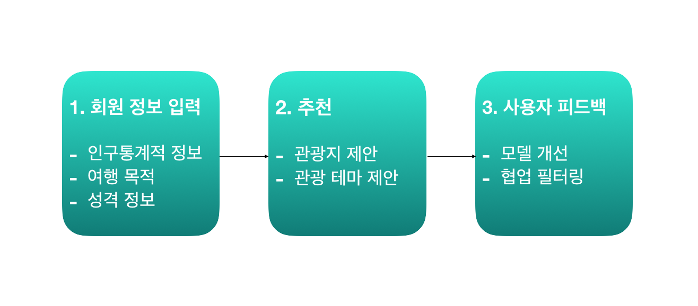

# 빅데이터 기반 한국 관광지 추천 시스템

## 개요

- 한국의 관광지를 Tripadvisor 리뷰를 기반으로 하는 잠재 디리클레 할당으로 분류하고, 외래관광객 실태조사 결과와 매치시켜 사용자에게 유사한 관광지 혹은 관광 테마 전반을 제안한다.

## 활용 데이터

### [2018 외래관광객 실태조사](https://kto.visitkorea.or.kr/kor/notice/data/statis/tstatus/forstatus/board/view.kto?id=431236&isNotice=false&instanceId=295&rnum=5)

- 한국관광공사가 우리나라를 방문한 외래관광객의 한국 여행실태, 한국내 소비실태 및 한국 여행 평가를 조사한 자료로 외래관광객의 한국 여행성향을 파악할 수 있음

### Tripadvisor 리뷰

- TripAdvisor는 호텔 및 레스토랑 리뷰, 숙박 예약 및 기타 여행 관련 콘텐츠를 보여주는 미국 여행 웹사이트로 해외 유저들 개개인이 느끼고 경험한 바가 리뷰로 남겨져 있음
- 외래관광객 실태조사의 <만족한 관광지>에 해당하는 관광지들을 추려, BeautifulSoup를 이용해 리뷰를 수집
- 535개 관광지 / 약 60,000개 리뷰

## 모델링

### 잠재 디리클레 할당

- LDA에서는 토픽 mixture 모델링이고 한 문서에 대해서 주제들의 기여도를 준다. 이를 활용하여 주어진 문서에 대하여 각 문서에 어떤 주제들이 존재하는지를 서술하는 대한 확률적 토픽 모델 기법 중 하나

**목적**

> LDA를 사용하는 이유는 텍스트 덩어리들의 집합인 관광지를 주제라는 심플렉스 즉, 숫자로 표현하기 위함이다.

1. 각 여행지는 $K$개의 토픽 mixture로 이루어져 있고 토픽 별로 word 등장 확률이 정해져 있다.
2. 리뷰 내의 단어들은 $K$개의 토픽 중 한 토픽에 의해서 generated됐다고 가정한다.  

LDA가 제안하기를...

> **문서 별 주제에 대한 사전 분포**는 multinomial distribution의 conjugate prior **Dirichlet distribution**
>
> **주제 별 단어 사전 분포**도 multinomial distribution의 conjugate prior인 **Dirichlet distribution**을 사용

이를 통해 얻어진 Dirichlet 사후 분포를 통해서 여행지를 토픽 심플렉스 $S^K$ 상의 원소로 볼 수 있는 이유는 

> Dirichlet 분포의 특징을 이용해 **문서 별 토픽에 대한 비율로** 표현할 수 있기 때문이다.

**Word distribution 기반 주제 해석**

토픽 1번 (도시 - 조용한)

> nami, **bike**, **aquarium**, everland, beach, rid, haeunda, **hangang**, **incheon**, franc, **yeouido**, basebal, blossom, cherri, **cycl**, gapyeong, petit, coex, arex, **songdo**, safari, sonata, ferri, island, bicycl, roller, layov, **cruis**, firework, coaster
>
> 예시 : 광안대교, 잠실야구장, 롯데시네마, 나미섬, 코엑스아쿠아리움, 여의도한강공원, 63빌딩, 에버랜드

토픽 2번 (도시 - 번화가의)

> **shop**, street, **cosmet**, **myeongdong**, brand, cathedr, food, jeonju, product, cloth, church, **fashion**, store, **skincar**, skin, mask, bargain, cathol, namdaemun, accessori, hanok, gamcheon, shopper, makeup, **itaewon**, lobster, trendi, sampl, heaven, mass
>
> 예시 : 명동, 신촌, 홍대, 이태원, 강남, 가로수길, 청담패션거리, 현대백화점, ~~한옥마을~~

토픽 3번 (역사 - 조용한)

> stream, **palac**, **templ**, north, fortress, suwon, tunne, lantern, gyeongbokgung, gwanghwamun, gyeongju, shrine, **hwaseong**, cheonggyecheon, buddha, border, **sejong**, seoraksan, guard, **bulguksa**, infiltr, dora, ceremoni, dorasan, soldier, squar, wall, king, **histori**
>
> 예시 : 광화문, 세종문화회관, 불국사, 월미도, 화성, 동화사, 제3터널, 팔공산

토픽 4번 (자연 - 조용한)

> **jeju**, seafood, hike, sunris, climb, **trail**, seongsan, crater, **rock**, hallasan, **peak**, diver, ilchulbong, summit, yeongsi, format, volcan, seongpanak, eorimok, **mysteri**, volcano, dragon, jagalchi, seogwipo, gwaneumsa, yongdusan, lava, dongmun, cliff, neutral
>
> 예시 : 제주도, 자갈치시장, 용두산, 용궁사, 태종대설악산, 울산바위, 미륵산, 거제도

### 선형회귀

- 종속 변수 y와 한 개 이상의 독립 변수 (또는 설명 변수) X와의 선형 상관 관계를 모델링하는 회귀분석 기법

Simplex를 종속 변수 y로 두는 회귀모형이 없는 관계로,  각 토픽마다 따로 선형회귀 모형을 만들려고 한다.

토픽 ~ 방문목적 + 국적 + 성별 + 연령

**단계**

1. AIC를 기반으로 stepwise selection을 사용하여 토픽을 설명하는데 필요한 모델을 고르게 된다.
2. 방문목적과 인구통계 변수가 들어왔을 때, 토픽1부터 4까지 예측한다.
3. 기존의 토픽 순위에 맞게 예측값을 변환한다. (이러한 변환이 없으면 애매한 토픽이 예측된다.)

4. 예측된 토픽을 기반으로 가장 가까운 여행지 3가지를 추천해준다.

## Shiny Application

### 접속
[이 주소](https://yonseitour.shinyapps.io/shiny_app/)로 접속하면 초기 화면이 생성된다.

### 입력
화면 좌측의 사이드 판넬에서 방문 목적, 연령대, 국가, 성별, 토픽을 선택하고 Complete 버튼을 누른다.

### 출력
세 개의 추천 관광지를 나타내는 리스트와 함께 각 관광지의 위치가 지도에 표시된다. 하단의 사진은 각 관광지를 대표하는 이미지를 보여준다.

